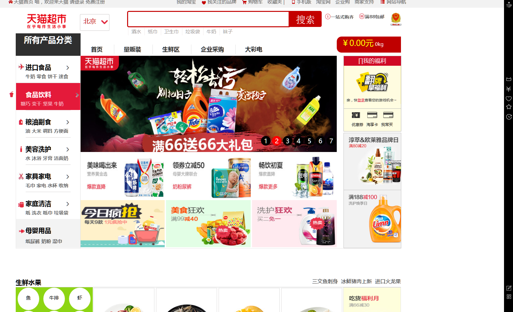
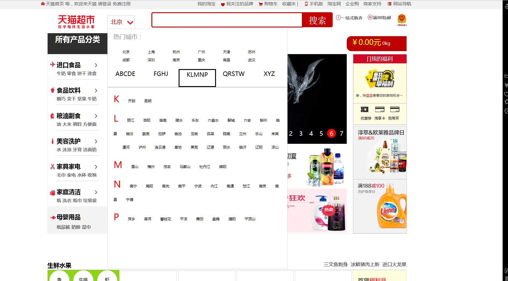

#   天猫超市Demo
##  基于React重构，组件化开发的天猫超市静态页面Demo
### 使用技术&工具
+   React（由于是本人早期学习react过程中的作品，未使用redux）
+   babel进行对es6语法进行转译
+   bowersify进行依赖处理，及打包

###    DEMO演示: <http://htmlpreview.github.io/?https://github.com/beastwinside/APP/blob/master/index.html> 
##     基本功能演示截图

####    工程化步骤： 

####    1 --文件分类准备 

- 1.1css目录，分为主界面css和component文件夹，component文件夹里面的css，主要写组件的样式； 

- 1.2js目录，主要分为source和biuld文件夹，source文件夹为原始js，build为经过babel转译的js文件，
- source和build文件夹都分app.js和componengt.js,app.js主要为调用小组件的入口，component里面为组件； 

- 1.3根目录下放置index.html； 
- 1.4根目录建立source文件夹，里面放app需要用到的静态文件资源； 

####    2 --编译 

- 2.1使用babel编译，使用babel需要先下载react的依赖包; 

- 下载react依赖包需要在根目录下package.json文件 

- package.json通过在命令行，键入npm init可以创建 

- 字段填写随意，创建玩package.json之后。安装react依赖。 

- 命令为： 

- npm install --save-dev react (--save-dev写进package.json意思) 

- npm install --save-dev react-dom 

- npm install --save-dev babel-preset-react 

- npm install --save-dev babel-preset-es2015. 

- 

- 通过babel编译转为es5命令（根目录下执行） 

- ：babel --preset react,es2015 js/source -d js/build 

- (转译规则为添加的react和es2015，把js/source目录下所有js文件转到 js/build文件夹下面) 

- ！！！！注意！！！！在调用babel命令前，必须新建babel的配置文件.babelrc 

- ，里面键入{ 

- "presets": [ 

- "es2015","react", ], 

- "plugins": [] 

- } 

- 

- 

- 其中es2015，react为编码规则。 

- 

####    3 --打包转译后的js文件 

- 用browserify,命令为 

- ：browserify js/build/app.js -o bundle.js 

- (打包js/build中的app.js，这个为应用入口，打包成一个bundle.js在根目录下) 

- 

- --打包css同理，css由于无依赖，可以手动打包为bundle.css 

- 放于根目录下。 

- 

####    4 --index.html中引用bundle.css和bundle.js即可 

